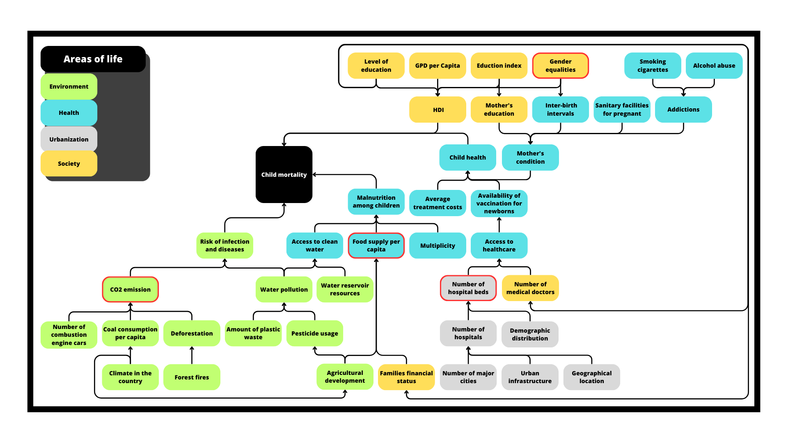

# Child Mortality Prediction Model

This project focuses on building a predictive model for child mortality based on global data. The dataset was sourced and preprocessed from the [Gapminder](https://www.gapminder.org/data/) platform. The model incorporates data marked on the diagram with a red outline, considering parameters from diverse life domains like Society, Environment, Urbanization, and Health.

## Project Results
The outcomes and detailed analysis can be found in the [report.pdf](report.pdf) file.

# Contributors 
- Norbert Podgórski
- Bartosz Sroka